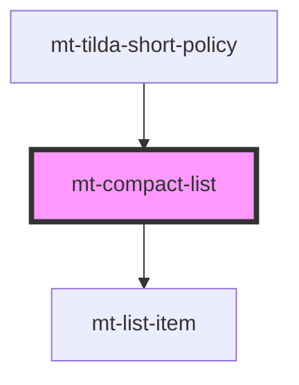

# mt-compact-list

<!-- Auto Generated Below -->

## Properties

| Property | Attribute | Description | Type     | Default     |
| -------- | --------- | ----------- | -------- | ----------- |
| `header` | `header`  |             | `string` | `undefined` |
| `image`  | `image`   |             | `string` | `undefined` |
| `items`  | `items`   |             | `string` | `undefined` |

## Dependencies

### Used by

 - [mt-tilda-short-policy](../../tilda/mt-tilda-short-policy)

### Depends on

- [mt-list-item](list-item)

### Graph

----------------------------------------------

*Built with [StencilJS](https://stenciljs.com/)*
