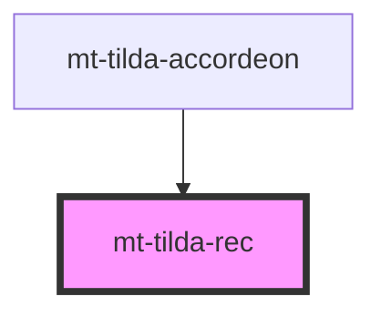

# mt-tilda-rec

<!-- Auto Generated Below -->

## Properties

| Property       | Attribute | Description | Type                                 | Default     |
| -------------- | --------- | ----------- | ------------------------------------ | ----------- |
| `auto`         | `auto`    |             | `boolean`                            | `true`      |
| `blockid`      | `blockid` |             | `string`                             | `undefined` |
| `getInitBlock` | --        |             | `(blockid: string) => InitBlockFunc` | `undefined` |
| `recid`        | `recid`   |             | `string`                             | `undefined` |
| `tildaBlock`   | --        |             | `InitBlock \| InitBlock[]`           | `[]`        |
| `waitFor`      | --        |             | `() => Promise<void>`                | `undefined` |

## Methods

### `initBlock(force?: boolean) => Promise<void>`

#### Returns

Type: `Promise<void>`

## Dependencies

### Used by

 - [mt-tilda-accordeon](../tilda-accordeon)

### Graph

----------------------------------------------

*Built with [StencilJS](https://stenciljs.com/)*
