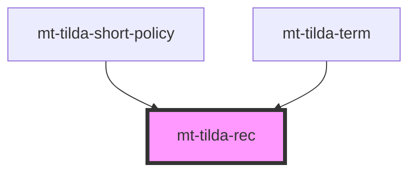

# mt-tilda-rec

<!-- Auto Generated Below -->

## Properties

| Property  | Attribute | Description | Type      | Default     |
| --------- | --------- | ----------- | --------- | ----------- |
| `blockid` | `blockid` |             | `string`  | `undefined` |
| `init`    | `init`    |             | `boolean` | `true`      |
| `recid`   | `recid`   |             | `string`  | `undefined` |

## Dependencies

### Used by

 - [mt-tilda-short-policy](../mt-tilda-short-policy)
 - [mt-tilda-term](../mt-tilda-term)

### Graph

----------------------------------------------

*Built with [StencilJS](https://stenciljs.com/)*
