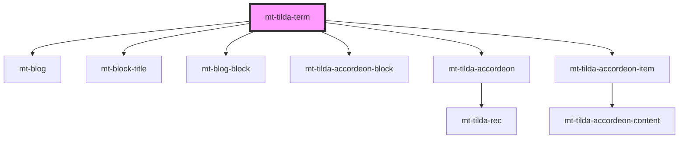

# mt-tilda-term

<!-- Auto Generated Below -->

## Properties

| Property          | Attribute          | Description | Type                     | Default     |
| ----------------- | ------------------ | ----------- | ------------------------ | ----------- |
| `accordeonShadow` | `accordeon-shadow` |             | `boolean`                | `false`     |
| `footer`          | `footer`           |             | `string`                 | `undefined` |
| `header`          | `header`           |             | `string`                 | `undefined` |
| `intro`           | `intro`            |             | `string`                 | `undefined` |
| `items`           | --                 |             | `MtTildaAccordeonItem[]` | `[]`        |

## Methods

### `addItem(item: MtTildaAccordeonItem) => Promise<void>`

#### Returns

Type: `Promise<void>`

### `forceRender() => Promise<void>`

#### Returns

Type: `Promise<void>`

### `init(force?: boolean) => Promise<void>`

#### Returns

Type: `Promise<void>`

## Dependencies

### Depends on

- [mt-blog](../../mt-blog)
- [mt-block-title](../../mt-block-title)
- [mt-blog-block](../../mt-blog/mt-blog-block)
- [mt-tilda-accordeon-block](../tilda-accordeon/tilda-accordeon-block)
- [mt-tilda-accordeon](../tilda-accordeon)
- [mt-tilda-accordeon-item](../tilda-accordeon/tilda-accordeon-item)

### Graph

----------------------------------------------

*Built with [StencilJS](https://stenciljs.com/)*
