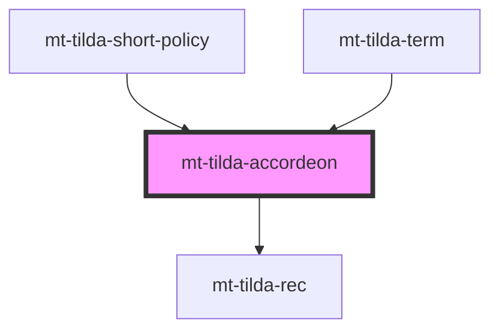

# mt-tilda-accordeon

<!-- Auto Generated Below -->

## Properties

| Property | Attribute | Description | Type      | Default |
| -------- | --------- | ----------- | --------- | ------- |
| `shadow` | `shadow`  |             | `boolean` | `true`  |

## Methods

### `init(force?: boolean) => Promise<void>`

#### Returns

Type: `Promise<void>`

## Dependencies

### Used by

 - [mt-tilda-short-policy](../mt-tilda-short-policy)
 - [mt-tilda-term](../mt-tilda-term)

### Depends on

- [mt-tilda-rec](../mt-tilda-rec)

### Graph

----------------------------------------------

*Built with [StencilJS](https://stenciljs.com/)*
