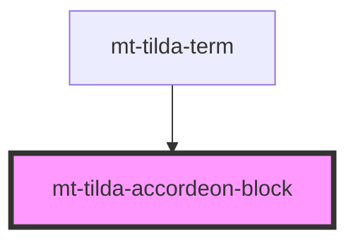

# tilda-accordeon-block

<!-- Auto Generated Below -->

## Properties

| Property     | Attribute    | Description | Type                  | Default    |
| ------------ | ------------ | ----------- | --------------------- | ---------- |
| `background` | `background` |             | `boolean`             | `true`     |
| `context`    | `context`    |             | `"normal" \| "popup"` | `'normal'` |

## Dependencies

### Used by

 - [mt-tilda-term](../../mt-tilda-term)

### Graph

----------------------------------------------

*Built with [StencilJS](https://stenciljs.com/)*
