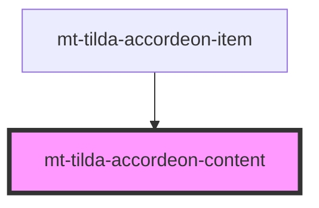

# mt-tilda-accordeon-content

<!-- Auto Generated Below -->

## Properties

| Property  | Attribute | Description | Type     | Default     |
| --------- | --------- | ----------- | -------- | ----------- |
| `content` | `content` |             | `string` | `undefined` |
| `header`  | `header`  |             | `string` | `undefined` |

## Dependencies

### Used by

 - [mt-tilda-accordeon-item](../tilda-accordeon-item)

### Graph

----------------------------------------------

*Built with [StencilJS](https://stenciljs.com/)*
