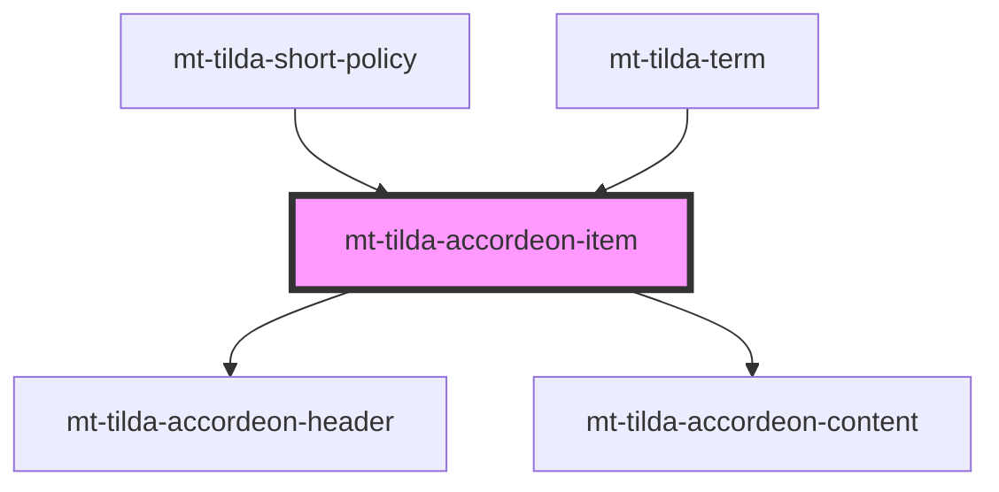

# mt-tilda-accordeon-item

<!-- Auto Generated Below -->

## Properties

| Property  | Attribute | Description | Type     | Default     |
| --------- | --------- | ----------- | -------- | ----------- |
| `content` | `content` |             | `string` | `undefined` |
| `header`  | `header`  |             | `string` | `undefined` |

## Dependencies

### Used by

 - [mt-tilda-short-policy](../../mt-tilda-short-policy)
 - [mt-tilda-term](../../mt-tilda-term)

### Depends on

- [mt-tilda-accordeon-header](../tilda-accordeon-header)
- [mt-tilda-accordeon-content](../tilda-accordeon-content)

### Graph

----------------------------------------------

*Built with [StencilJS](https://stenciljs.com/)*
